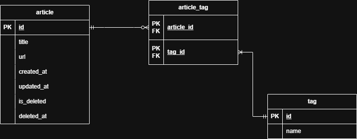

# WebTag Design Doc

<!--
TODO
１. article searchの計算量問題
***必要ならデータ構造の変更***

2. dogstring や README 等の書き物を完成させる
-->

## 1. Context

## 2. Goals

## 3. Non-Goals

## 4. Tech Stack

### Frontend

| Component | Technology | Version |
| --------- | ---------- | ------- |
| Language  | TypeScript | 5.9.3   |
| Framework | React      | 19.2.0  |
| Build     | Vite       | 7.2.4   |

### Backend

| Component | Technology | Version |
| --------- | ---------- | ------- |
| Language  | Python     | 3.12.3  |
| ORM       | SQLAlchemy | 2.0.45  |
| Migration | Alembic    | 1.18.1  |

### API

| Component       | Technology | Version |
| --------------- | ---------- | ------- |
| Framework       | FastAPI    | 0.128.0 |
| Data Validation | Pydantic   | 2.12.5  |

### Database

| Component | Technology | Version |
| --------- | ---------- | ------- |
| Database  | PostgreSQL | 16.11   |

## 5. Database Schema

### article Table

| Column     | Type                     | Constraints                         | Description       |
| ---------- | ------------------------ | ----------------------------------- | ----------------- |
| id         | INTEGER 　               | PK                                  | Article id        |
| title      | VARCHAR(300)             | NOT NULL                            | Article title     |
| url        | VARCHAR(2083)            | NOT NULL                            | Article URL       |
| created_at | TIMESTAMP WITH TIME ZONE | NOT NULL, DEFAULT CURRENT_TIMESTAMP | Creation time     |
| updated_at | TIMESTAMP WITH TIME ZONE | NOT NULL, DEFAULT CURRENT_TIMESTAMP | Last updated time |
| is_deleted | BOOLEAN                  | NOT NULL, DEFAULT FALSE             | Soft delete flag  |
| deleted_at | TIMESTAMP WITH TIME ZONE | NULL                                | Deletion time     |

### tag Table

| Column | Type         | Constraints | Description |
| ------ | ------------ | ----------- | ----------- |
| id     | INTEGER      | PK          | Tag id      |
| name   | VARCHAR(300) | NOT NULL    | Tag name    |

### article_tag Table

| Column     | Type    | Constraints | Description |
| ---------- | ------- | ----------- | ----------- |
| article_id | INTEGER | PK, FK      | article.id  |
| tag_id     | INTEGER | PK, FK      | tag.id      |

## 6. ER Diagram



## 7. API Design

| Endpoint                             | Method | Request Body  | Response Body         | Status Code | Description                      |
| ------------------------------------ | ------ | ------------- | --------------------- | ----------- | -------------------------------- |
| /articles                            | POST   | ArticleCreate | ArticleResponse       | 201/422     | Create article                   |
| /articles/{id}                       | DELETE | None          | None                  | 204/404     | Soft delete article              |
| /articles                            | DELETE | None          | None                  | 204         | Soft delete all articles         |
| /articles/{id}                       | GET    | None          | ArticleResponse       | 200/404     | Get article                      |
| /articles                            | GET    | None          | list[ArticleResponse] | 200         | Get all articles                 |
| /articles/{id}                       | PATCH  | ArticleUpdate | ArticleResponse       | 200/400/404 | Update article                   |
| /articles/deleted/{id}/restore       | POST   | None          | ArticleResponse       | 200/404     | Restore deleted article          |
| /articles/deleted/restore            | POST   | None          | RestoreAllResponse    | 200         | Restore all deleted articles     |
| /articles/deleted/{id}               | DELETE | None          | None                  | 204/404     | Hard delete deleted article      |
| /articles/deleted                    | DELETE | None          | None                  | 204         | Hard delete all deleted articles |
| /articles/deleted/{id}               | GET    | None          | ArticleResponse       | 200/404     | Get deleted article              |
| /articles/deleted                    | GET    | None          | list[ArticleResponse] | 200         | Get all deleted articles         |
| /tags                                | POST   | TagCreate     | TagResponse           | 201/422     | Create tag                       |
| /tags/{id}                           | DELETE | None          | None                  | 204/404     | Hard delete tag                  |
| /tags                                | DELETE | None          | None                  | 204         | Hard delete all tags             |
| /tags/{id}                           | GET    | None          | TagResponse           | 200/404     | Get tag                          |
| /tags                                | GET    | None          | list[TagResponse]     | 200         | Get all tags                     |
| /tags/{id}                           | PATCH  | TagUpdate     | TagResponse           | 200/400/404 | Update tag                       |
| /articles/{article_id}/tags/{tag_id} | POST   | None          | ArticleTagResponse    | 201/404/409 | Attach tag to the article        |
| /articles/{article_id}/tags/{tag_id} | DELETE | None          | None                  | 204/404     | Remove tag from the article      |
| /articles/{article_id}/tags          | GET    | None          | list[TagResponse]     | 200/404     | Get tags attached to the article |

## 8. API Request/Response Schemas

### ArticleCreate

```json
{
    "title": string,
    "url": HttpUrl
}
```

### ArticleUpdate

```json
{
    "title": string | None = None,
    "url": HttpUrl | None = None
}
```

### TagCreate

```json
{
    "name": string
}
```

### TagUpdate

```json
{
    "name": string
}
```

<hr/>

### ArticleResponse

```json
{
    "id": integer,
    "title": string,
    "url": string
}
```

### TagResponse

```json
{
    "id": integer,
    "name": string
}
```

### ArticleTagResponse

```json
{
    "article_id": integer,
    "tag_id": integer
}
```

### RestoreAllResponse

```json
{
    "restored_count": integer
}
```

### Error Responses

- 400: Invalid request
- 404: Resource not found
- 409: Conflict
- 422: Validation Error

## 9. Frontend Design

### Page Structure

### Component Hierarchy
