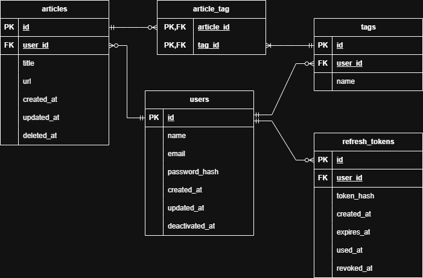

# WebTag Design Doc

## 1. Context

## 2. Goals

## 3. Non-Goals

## 4. Tech Stack

### Frontend

| Component | Technology | Version |
| --------- | ---------- | ------- |
| Language  | TypeScript | 5.9.3   |
| Framework | React      | 19.2.0  |
| Build     | Vite       | 7.2.4   |

### Backend

| Component | Technology | Version |
| --------- | ---------- | ------- |
| Language  | Python     | 3.12.3  |
| ORM       | SQLAlchemy | 2.0.45  |
| Migration | Alembic    | 1.18.1  |

### API

| Component       | Technology | Version |
| --------------- | ---------- | ------- |
| Framework       | FastAPI    | 0.128.0 |
| Data Validation | Pydantic   | 2.12.5  |

### Database

| Component | Technology | Version |
| --------- | ---------- | ------- |
| Database  | PostgreSQL | 16.11   |

## 5. Database Schema

### users Table

| Column          | Type                     | Constraints                         | Description          |
| --------------- | ------------------------ | ----------------------------------- | -------------------- |
| id              | BIGINT                   | PK                                  | User id              |
| public_id       | UUID                     | UNIQUE, NOT NULL                    | User display id      |
| name            | VARCHAR(100)             | NOT NULL                            | User name            |
| email           | VARCHAR(300)             | UNIQUE, NOT NULL                    | User email           |
| Hashed_password | VARCHAR(500)             | NOT NULL                            | Hashed user password |
| created_at      | TIMESTAMP WITH TIME ZONE | DEFAULT CURRENT_TIMESTAMP, NOT NULL | Creation time        |
| updated_at      | TIMESTAMP WITH TIME ZONE | DEFAULT CURRENT_TIMESTAMP, NOT NULL | Last updated time    |
| is_active       | BOOLEAN                  | DEFAULT FALSE, NOT NULL             | Account active flag  |
| deactivated_at  | TIMESTAMP WITH TIME ZONE | NULL                                | deactivated time     |

**Referenced by:**

- FOREIGN KEY articles(user_id) REFERENCES users(id) ON DELETE CASCADE
- FOREIGN KEY tags(user_id) REFERENCES users(id) ON DELETE CASCADE
- FOREIGN KEY refresh_tokens(user_id) REFERENCES users(id) ON DELETE CASCADE

### articles Table

| Column     | Type                     | Constraints                         | Description        |
| ---------- | ------------------------ | ----------------------------------- | ------------------ |
| id         | BIGINT 　                | PK                                  | Article id         |
| public_id  | UUID                     | UNIQUE, NOT NULL                    | Article display id |
| user_id    | BIGINT                   | FK, NOT NULL                        | users.id           |
| title      | VARCHAR(500)             | NOT NULL                            | Article title      |
| url        | VARCHAR(2500)            | NOT NULL                            | Article URL        |
| created_at | TIMESTAMP WITH TIME ZONE | DEFAULT CURRENT_TIMESTAMP, NOT NULL | Creation time      |
| is_deleted | BOOLEAN                  | DEFAULT FALSE, NOT NULL             | Soft delete flag   |
| deleted_at | TIMESTAMP WITH TIME ZONE | NULL                                | Deletion time      |

**Foreign-key constraints:**

- FOREIGN KEY articles(user_id) REFERENCES users(id) ON DELETE CASCADE

**Referenced by:**

- FOREIGN KEY article_tag(article_id) REFERENCES articles(id) ON DELETE CASCADE

**Indexes:**

```sql
CREATE INDEX ix_article_user_title_lower
ON articles(user_id, LOWER(title))
WHERE is_deleted = FALSE;

CREATE INDEX ix_article_user_created_at
ON articles(user_id, created_at)
WHERE is_deleted = FALSE;

CREATE INDEX ix_article_user_updated_at
ON articles(user_id, updated_at)
WHERE is_deleted = FALSE;

CREATE INDEX ix_article_user_deleted_at
ON articles(user_id, deleted_at)
WHERE is_deleted = TRUE;
```

### tags Table

| Column    | Type         | Constraints      | Description    |
| --------- | ------------ | ---------------- | -------------- |
| id        | BIGINT       | PK               | Tag id         |
| public_id | UUID         | UNIQUE, NOT NULL | Tag display id |
| user_id   | BIGINT       | FK, NOT NULL     | users.id       |
| name      | VARCHAR(100) | NOT NULL         | Tag name       |

**Foreign-key constraints:**

- FOREIGN KEY tags(user_id) REFERENCES users(id) ON DELETE CASCADE

**Referenced by:**

- FOREIGN KEY article_tag(tag_id) REFERENCES tags(id) ON DELETE CASCADE

**Indexes:**

```sql
CREATE INDEX ix_tag_user_name_lower
ON tags(user_id, LOWER(name))
```

### article_tag Table

| Column     | Type   | Constraints | Description |
| ---------- | ------ | ----------- | ----------- |
| article_id | BIGINT | PK, FK      | articles.id |
| tag_id     | BIGINT | PK, FK      | tags.id     |

**Foreign-key constraints:**

- FOREIGN KEY article_tag(article_id) REFERENCES articles(id) ON DELETE CASCADE
- FOREIGN KEY article_tag(tag_id) REFERENCES tags(id) ON DELETE CASCADE

### refresh_tokens Table

| Column       | Type                     | Constraints                         | Description      |
| ------------ | ------------------------ | ----------------------------------- | ---------------- |
| id           | BIGINT                   | PK                                  | Refresh token id |
| user_id      | BIGINT                   | FK, NOT NULL                        | users.id         |
| hashed_token | VARCHAR(300)             | UNIQUE, NOT NULL                    | Hashed token     |
| created_at   | TIMESTAMP WITH TIME ZONE | DEFAULT CURRENT_TIMESTAMP, NOT NULL | Creation time    |
| expires_at   | TIMESTAMP WITH TIME ZONE | NOT NULL                            | Expiration time  |
| revoked_at   | TIMESTAMP WITH TIME ZONE | NULL                                | Revoked time     |

**Foreign-key constraints:**

- FOREIGN KEY refresh_tokens(user_id) REFERENCES users(id) ON DELETE CASCADE

**Indexes:**

```sql
CREATE INDEX ix_refresh_tokens_user_active
ON refresh_tokens(user_id)
WHERE revoked_at IS NULL;

CREATE INDEX ix_refresh_tokens_expires
ON refresh_tokens(expires_at)
WHERE revoked_at IS NULL

CREATE INDEX ix_refresh_tokens_cleanup
ON refresh_tokens(expires_at)
WHERE revoked_at IS NOT NULL
```

## 6. ER Diagram



## 7. API Design

### Users

| Endpoint | Method | Request Body | Response Body | Status Code | Description |
| -------- | ------ | ------------ | ------------- | ----------- | ----------- |
| /users   | POST   | UserCreate   | UserResponse  | 201/409/422 | Create user |

### Articles

| Endpoint              | Method | Request Body  | Response Body         | Status Code | Description              |
| --------------------- | ------ | ------------- | --------------------- | ----------- | ------------------------ |
| /articles             | POST   | ArticleCreate | ArticleResponse       | 201/422     | Create article           |
| /articles/{public_id} | GET    | None          | ArticleResponse       | 200/404     | Get article              |
| /articles             | GET    | None          | list[ArticleResponse] | 200         | Get all articles         |
| /articles/{public_id} | PATCH  | ArticleUpdate | ArticleResponse       | 200/400/404 | Update article           |
| /articles/{public_id} | DELETE | None          | None                  | 204/404     | Soft delete article      |
| /articles             | DELETE | None          | None                  | 204         | Soft delete all articles |

### Deleted Articles

| Endpoint                              | Method | Request Body | Response Body         | Status Code | Description                      |
| ------------------------------------- | ------ | ------------ | --------------------- | ----------- | -------------------------------- |
| /articles/deleted/{public_id}/restore | POST   | None         | ArticleResponse       | 200/404     | Restore deleted article          |
| /articles/deleted/restore             | POST   | None         | RestoreAllResponse    | 200         | Restore all deleted articles     |
| /articles/deleted/{public_id}         | GET    | None         | ArticleResponse       | 200/404     | Get deleted article              |
| /articles/deleted                     | GET    | None         | list[ArticleResponse] | 200         | Get all deleted articles         |
| /articles/deleted/{public_id}         | DELETE | None         | None                  | 204/404     | Hard delete deleted article      |
| /articles/deleted                     | DELETE | None         | None                  | 204         | Hard delete all deleted articles |

### Tags

| Endpoint          | Method | Request Body | Response Body     | Status Code | Description          |
| ----------------- | ------ | ------------ | ----------------- | ----------- | -------------------- |
| /tags             | POST   | TagCreate    | TagResponse       | 201/422     | Create tag           |
| /tags/{public_id} | GET    | None         | TagResponse       | 200/404     | Get tag              |
| /tags             | GET    | None         | list[TagResponse] | 200         | Get all tags         |
| /tags/{public_id} | PATCH  | TagUpdate    | TagResponse       | 200/400/404 | Update tag           |
| /tags/{public_id} | DELETE | None         | None              | 204/404     | Hard delete tag      |
| /tags             | DELETE | None         | None              | 204         | Hard delete all tags |

### ArticleTag

| Endpoint                             | Method | Request Body | Response Body      | Status Code | Description                      |
| ------------------------------------ | ------ | ------------ | ------------------ | ----------- | -------------------------------- |
| /articles/{article_id}/tags/{tag_id} | POST   | None         | ArticleTagResponse | 201/404/409 | Attach tag to the article        |
| /articles/{article_id}/tags          | GET    | None         | list[TagResponse]  | 200/404     | Get tags attached to the article |
| /articles/{article_id}/tags/{tag_id} | DELETE | None         | None               | 204/404     | Remove tag from the article      |

## 8. API Request/Response Schemas

### Request Schemas

#### UserCreate

**Fields:**

| Field           | Type   | Required | Constraints           | Description           |
| --------------- | ------ | -------- | --------------------- | --------------------- |
| name            | string | Yes      | min 1, max 50 chars   | User name             |
| email           | string | Yes      | max 254 chars, Unique | User email            |
| password        | string | Yes      | min 8, max 128        | User password (plain) |
| password_repeat | string | Yes      | same as password      | repeat password       |

#### ArticleCreate

**Fields:**

| Field | Type         | Required | Constraints          | Description   |
| ----- | ------------ | -------- | -------------------- | ------------- |
| title | string       | Yes      | min 1, max 255 chars | Article title |
| url   | string (URL) | Yes      | max 2083 chars       | Article URL   |

**Example:**

```json
{
  "title": "title",
  "url": "https://example.com"
}
```

#### ArticleUpdate

**Fields:**

| Field | Type         | Required | Constraints    | Description   |
| ----- | ------------ | -------- | -------------- | ------------- |
| title | string       | No       | max 300 chars  | Article title |
| url   | string (URL) | No       | max 2083 chars | Article URL   |

**Example:**

```json
{
  "title": "new title",
  "url": "https://example.com"
}
```

#### TagCreate

**Fields:**

| Field | Type   | Required | Constraints   | Description |
| ----- | ------ | -------- | ------------- | ----------- |
| name  | string | Yes      | max 300 chars | Tag name    |

**Example:**

```json
{
  "name": "tag"
}
```

#### TagUpdate

**Fields:**

| Field | Type   | Required | Constraints   | Description |
| ----- | ------ | -------- | ------------- | ----------- |
| name  | string | Yes      | max 300 chars | Tag name    |

**Example:**

```json
{
  "name": "new tag"
}
```

### Response Schemas

#### ArticleResponse

**Fields:**

| Field | Type         | Description   |
| ----- | ------------ | ------------- |
| id    | integer      | Article id    |
| title | string       | Article title |
| url   | string (URL) | Article URL   |

**Example:**

```json
{
  "id": 1,
  "title": "title",
  "url": "https://example.com"
}
```

#### TagResponse

**Fields:**

| Field | Type    | Description |
| ----- | ------- | ----------- |
| id    | integer | Tag id      |
| name  | string  | Tag name    |

**Example:**

```json
{
  "id": 1,
  "name": "tag"
}
```

#### ArticleTagResponse

**Fields:**

| Field      | Type    | Description |
| ---------- | ------- | ----------- |
| article_id | integer | Article id  |
| tag_id     | integer | tag id      |

**Example:**

```json
{
  "article_id": 1,
  "tag_id": 2
}
```

#### RestoreAllResponse

**Fields:**

| Field          | Type    | Description    |
| -------------- | ------- | -------------- |
| restored_count | integer | restored count |

**Example:**

```json
{
  "restored_count": 2
}
```

### Status Codes

| Status Code | Meaning |
| ----------- | ------- |
| 200         |         |
| 201         |         |
| 204         |         |
| 400         |         |
| 404         |         |
| 409         |         |
| 422         |         |

- 400: Invalid request
- 404: Resource not found
- 409: Conflict
- 422: Validation Error

## 9. Frontend Design

### Page Structure

### Component Hierarchy
